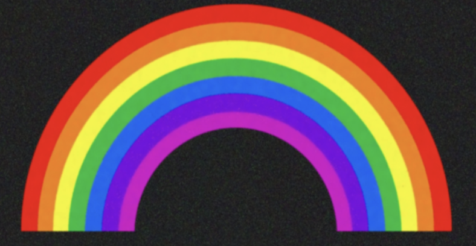

# Image Clustering and Pixel Segmentation

This repository contains my Homework 2 project for Data Acquisition and Management. The project analyzes a rainbow image as pixel-level data, cleans noisy pixels, and applies clustering techniques to segment the image.

## Project Tasks

The homework is organized into four main tasks:

1. Create a dataset from an image by extracting each pixel's RGB values and x/y coordinates.
2. Visualize the image data and clean noisy pixels.
3. Apply KMeans clustering with scikit-learn.
4. Implement a custom clustering algorithm with PyTorch.

## Methods and Libraries

- Python
- Jupyter Notebook
- NumPy and pandas for pixel data processing
- Pillow for image loading
- matplotlib and seaborn for visualization
- scikit-learn for KMeans clustering and scaling
- PyTorch for custom clustering
- OpenCV for denoising in the completed answer notebook

## Input and Results Preview

The image is converted into a table where each row represents one pixel.

```text
    R   G   B  x  y
0  68  67  49  0  0
1  42  43  27  1  0
2  43  43  31  2  0
3  34  35  27  3  0
4  50  49  44  4  0
```

Input Image

Cleaned Image



## How to Run Locally

1. Install the dependencies:

   ```bash
   pip install -r requirements.txt
   ```

2. Place the input image `rainbow.jpg` in the same folder as the notebook you want to run.

3. Start Jupyter Notebook:

   ```bash
   jupyter notebook
   ```

4. Open `Image clustering.ipynb`.

## Note

The notebooks reference a rainbow image as the source input. The image file was not present in the original project folder when this GitHub-ready folder was prepared, so it must be added before rerunning the notebooks from the beginning.
